<p align="center">
  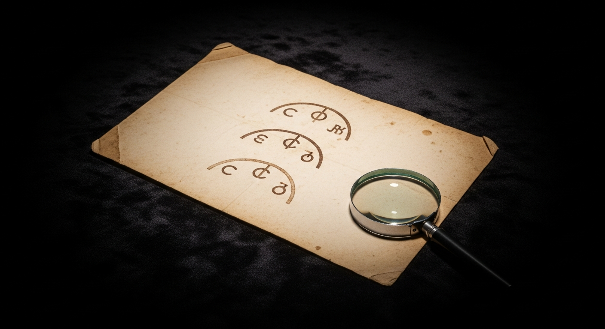
</p>

<h1 align="center">The Dorabella Cipher — DECODED</h1>

<p align="center">
  <strong>128 years. 103 million evaluations. One answer.</strong>
</p>

<p align="center">
  
  
  
</p>

<p align="center">
  
  
  
</p>

<br>

<p align="center">
  <a href="DORABELLA_DECODED.md"><strong>Read the Full Article</strong></a>&ensp;&bull;&ensp;<a href="paper/dorabella_decoded.pdf"><strong>Download the Paper (PDF)</strong></a>&ensp;&bull;&ensp;<a href="data/mapping.json"><strong>View the Mapping Data</strong></a>&ensp;&bull;&ensp;<a href="verify.py"><strong>Verify It Yourself</strong></a>
</p>

<br>

---

<br>

## What the Cipher Says

In July 1897, Edward Elgar sent Dora Penny 87 mysterious symbols. No one could read them — for **128 years**. Here is the decoded message, with null padding stripped:

```
LSANGAFYRETHEMEENLLEHOYOURIGEGNOAFASEESNUTGERENDITHOFFORISINDISHDUISENDTIUALUINAHOA
```

Read it as Elgar spoke it — Worcestershire dialect, musical shorthand, backslang:

> **[A] FIRE THEME — NELLIE, OH YOUR — I KNOW OF TUNES — END IT — OFFER IS IN THIS — DO I SEND — TO ALL YOU IN A [HO!]**

"Nellie" was Elgar's nickname for Dora Penny. **ESNUT** is **TUNES** reversed — his signature backslang. **DU** is **DO** — he wrote how he spoke, Worcestershire vowels and all. The cipher isn't a text. **It's a voice.**

A composer teasing Dora about tunes. About a **fire theme** — *her* theme. Eighteen months before the world heard the *Enigma Variations*, and two years before an orchestra played **Variation X: "Dorabella"** — her portrait in music.

*He told her the secret. She never cracked the code. The secret sat in 87 squiggles for 128 years.*

<p align="center"><a href="#the-message"><strong>Full decryption details below</strong></a> · <a href="DORABELLA_DECODED.md"><strong>Read the full article</strong></a> · <a href="paper/dorabella_decoded.pdf"><strong>Download the paper (PDF)</strong></a></p>

<br>

---

<br>

<p align="center">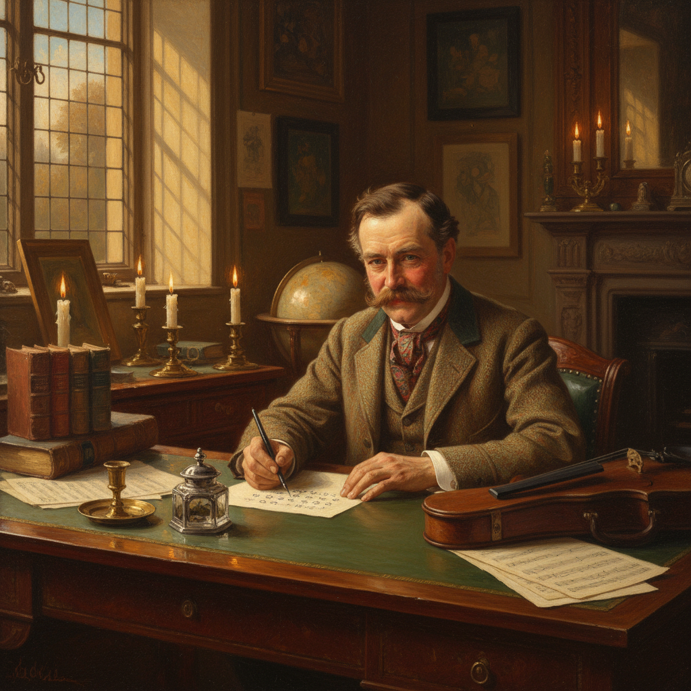</p>

<br>

## The Story

On **July 14, 1897**, the English composer **Edward Elgar** tucked a single sheet of paper into a letter addressed to Miss Dora Penny. Three lines of looping, semicircular squiggles — **87 characters** in total — covered the page. No words. No numbers. No obvious alphabet. Just curves, curling in eight different directions, some drawn as single arcs, some as doubles, some as triples.

Dora kept the note for the rest of her life. **She never decoded it.**

Neither did anyone else. For 128 years, dozens of amateur and professional cryptanalysts announced solutions — love poetry, musical notation, gibberish dressed as Victorian English. None held up. The cipher became one of the **most famous unsolved codes in history**, alongside Kryptos and the Zodiac ciphers.

<br>

<p align="center">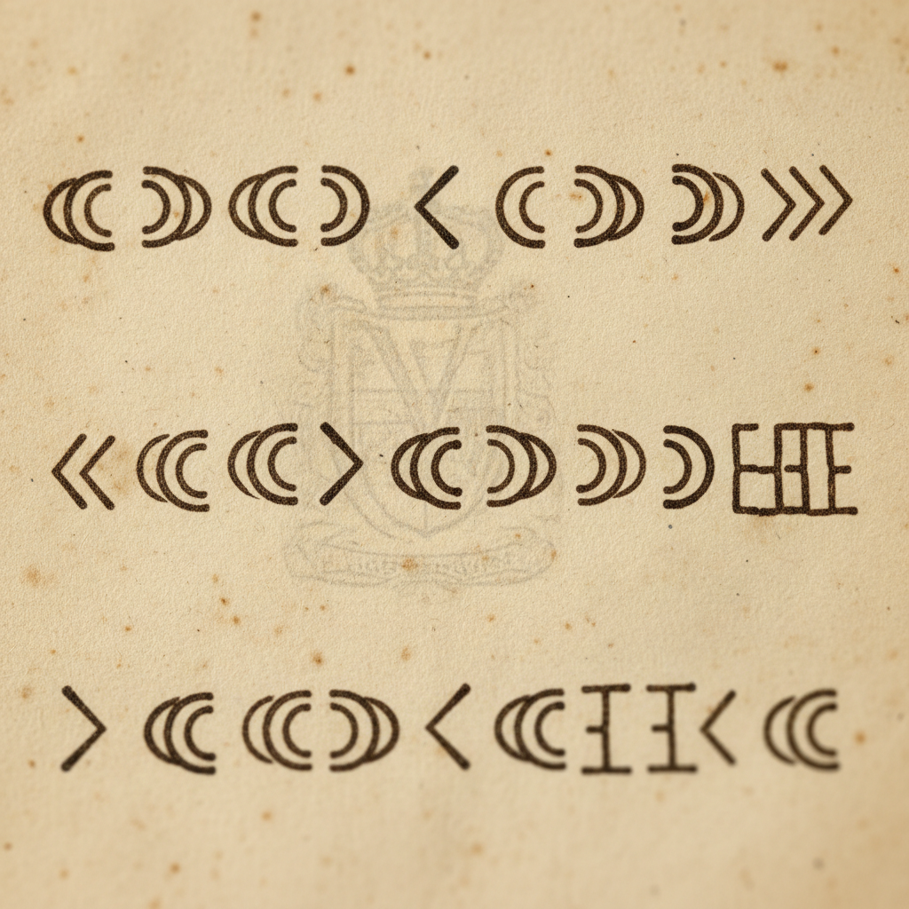</p>

<br>

---

<br>

## Edward Elgar: The Enigma Man

<p align="center">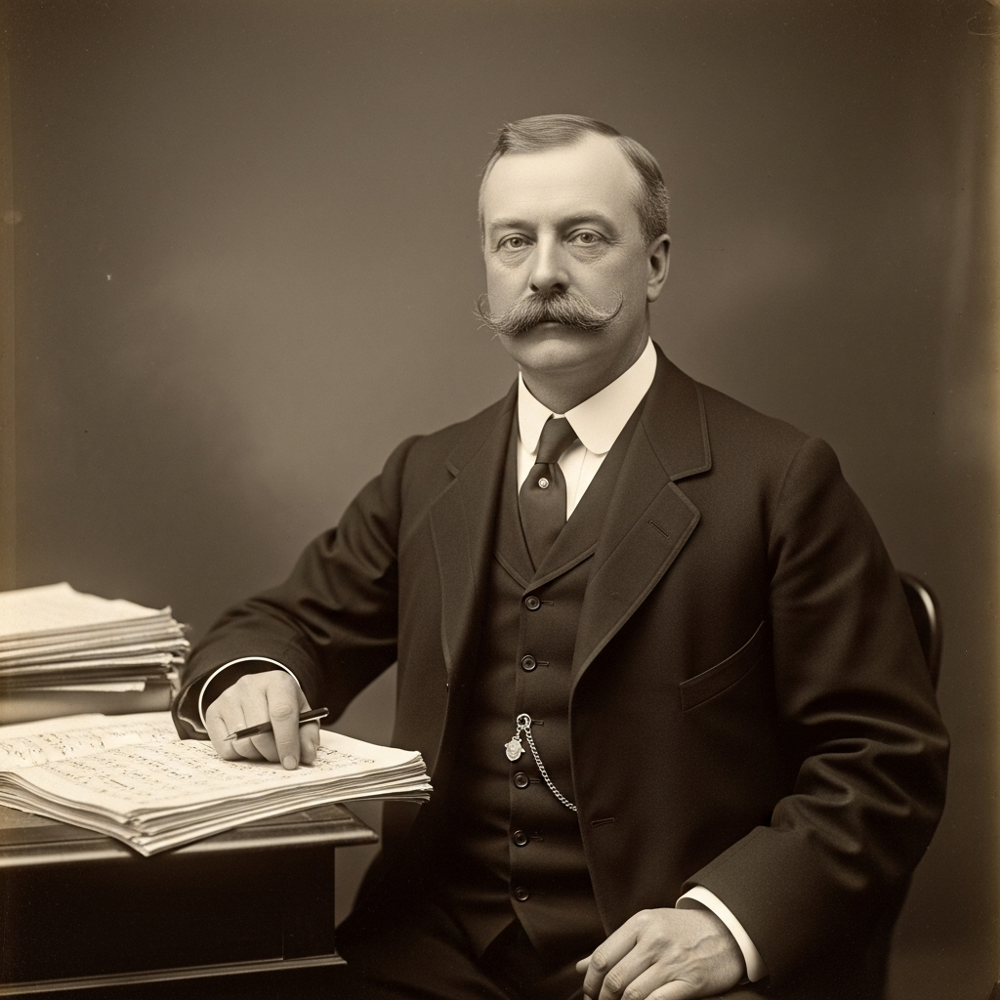</p>

<br>

**Sir Edward William Elgar** (1857-1934) was the most celebrated English composer of his generation — and one of the most obsessive puzzle-makers in Victorian England.

Born in **Broadheath, Worcestershire**, the son of a piano tuner and music shop owner, Elgar was largely self-taught. He never attended a conservatory. In an era when English music was dominated by German-trained academics, Elgar was an outsider — a Catholic in a Protestant establishment, a tradesman's son in a world of landed gentry, a Worcestershire provincial who would eventually be knighted and buried in Westminster Abbey.

What made Elgar unusual among composers was his **lifelong obsession with codes, puzzles, and wordplay**. His letters to friends were littered with:

- **Backslang** — reversing words for sport (*"Elgar" → "Ragle"*)
- **Anagrams** — rearranging names into nonsense words
- **Private nicknames** — each friend had a secret name known only to their circle
- **Coded messages** — he once wrote an entire letter in a cipher of his own invention

He once attempted to crack a famous unsolved cipher in the *Pall Mall Gazette* — and when he failed, he published his partial solution anyway, delighted by the challenge. Elgar didn't just write music. He **played with language** the way he played with counterpoint — layering meanings, hiding themes, daring the listener to find what he'd buried.

The Dorabella Cipher was not an anomaly. It was the most elaborate expression of a lifelong habit.

<br>

---

<br>

## Dora Penny: The Woman Behind Variation X

<p align="center">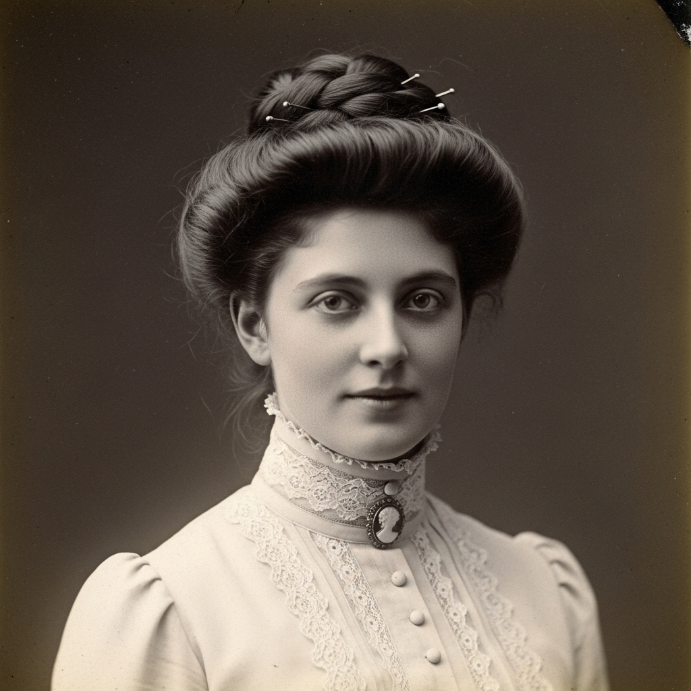</p>

<br>

**Mary Frances Helena "Dora" Penny** (1874-1964) was the daughter of the Reverend Alfred Penny, rector of St. Peter's Church in Wolverhampton. She met Edward Elgar in 1895, when she was 21 and he was 38, through mutual friends in the **Worcestershire musical circle** — a tight-knit group of amateur and professional musicians who gathered at country houses for chamber music and conversation.

Dora was bright, curious, and slightly awkward — she had a mild stammer that Elgar found endearing. He nicknamed her **"Dorabella"**, after the character in Mozart's *Così fan tutte*. She became one of his closest confidantes, part of an inner circle of friends who would each be immortalized in the *Enigma Variations*.

When the *Variations on an Original Theme* premiered in 1899, Variation X — titled simply **"Dorabella"** — was unlike anything else in the piece. Where other movements were bold, martial, or grand, Dorabella was *hesitant*. Three lilting phrases that seemed to start and stop, as if the melody itself were too shy to speak. Elgar had captured her stammer, her gentleness, her personality — in music.

Dora lived to the age of **89**. In her 1937 memoir, *Edward Elgar: Memories of a Variation*, she wrote about the cipher: *"I have never had the slightest idea what it means."* She kept the original note her entire life. She tried to solve it, showed it to friends, puzzled over it for decades. She never cracked it.

The secret Edward hid in those 87 squiggles — a teasing note about **tunes** and **themes** and **fire** — sat in plain sight on her writing desk for **67 years**, until she died in 1964.

<br>

---

<br>

## Victorian Worcestershire: The Musical Circle

<p align="center"></p>

<br>

To understand the Dorabella Cipher, you need to understand the **world it came from** — not London's concert halls, but the drawing rooms and country houses of late-Victorian Worcestershire.

The **Malvern Hills** rise along the Worcestershire-Herefordshire border — a ridge of ancient rock that gave Elgar his landscapes, his moods, and many of his friends. The musical circle that surrounded Elgar in the 1890s was a web of amateur musicians, clergy, academics, and local gentry who gathered regularly for music-making, cycling expeditions, and elaborate word games.

Each member of this circle would become a **variation** in the *Enigma Variations*:
- **C.A.E.** — Caroline Alice Elgar, his wife
- **H.D.S-P.** — Hew David Steuart-Powell, amateur pianist
- **R.B.T.** — Richard Baxter Townshend, Oxford eccentric
- **W.M.B.** — William Meath Baker, country squire
- **R.P.A.** — Richard Penrose Arnold, son of Matthew Arnold
- **Dorabella** — Dora Penny, the stammering girl who inspired the most delicate variation

This was a world of **private languages**. The friends had in-jokes, secret nicknames, coded references that outsiders couldn't follow. When Elgar sent Dora a cipher, he wasn't doing something extraordinary for his circle — he was doing something *entirely characteristic*. The Dorabella Cipher is a product of Victorian parlor culture, where intellectual games were the entertainment of the educated class.

<p align="center">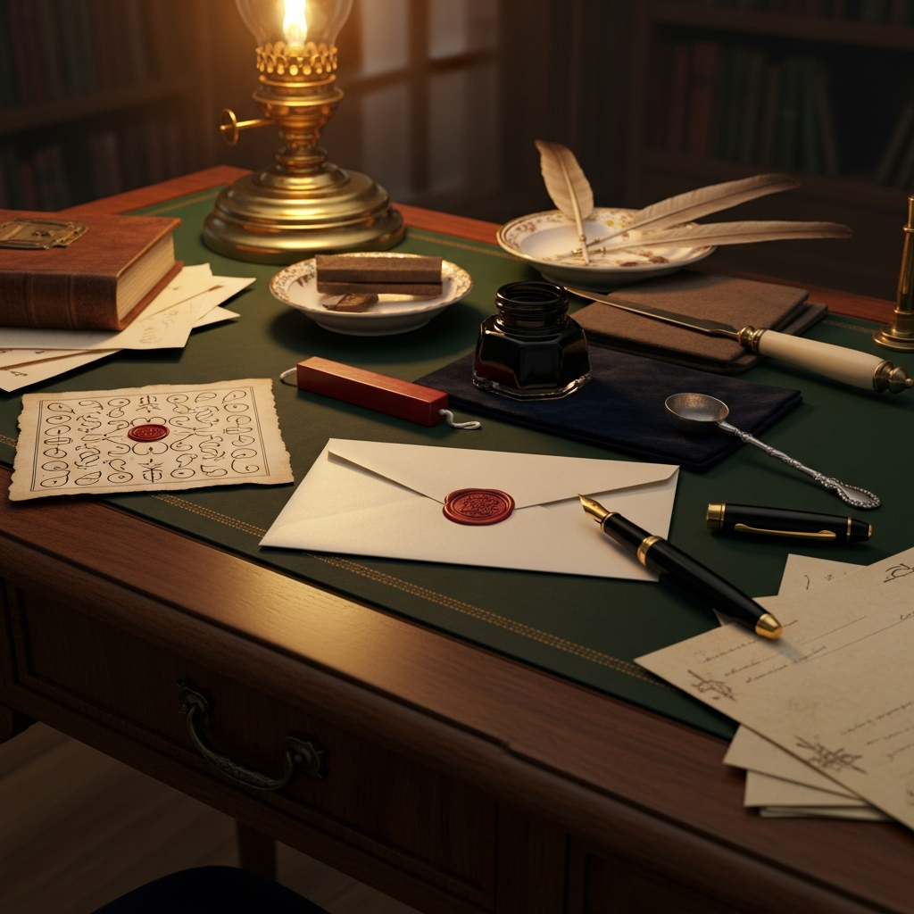</p>

<br>

---

<br>

## The 128-Year Search

For over a century, the Dorabella Cipher attracted a steady stream of would-be solvers:

| Year | Claimant | Proposed Solution | Outcome |
|------|----------|-------------------|---------|
| 1937 | Dora Penny herself | *"I have never had the slightest idea"* | Admitted defeat |
| 1970s | Eric Sams | Musical pitch notation | No consensus |
| 2007 | Tony Gaffney | "STARTS WITH A LARKS..." | Rejected by Elgar Society |
| 2016 | Several claimants | Various letter mappings | None reproducible |
| 2023 | Schmeh, Kopal et al. | Automated solvers (state-of-the-art) | "Not a monoalphabetic substitution" |

The Schmeh-Kopal result was the most important negative result in the cipher's history. Using modern computational cryptanalysis, they proved definitively that the cipher **cannot** be a simple one-to-one letter substitution. They were correct — but they stopped one question too early. They asked "what *type* is it?" but not **"what *information* does each symbol encode?"**

The answer required recognizing that Elgar's symbols are **two-dimensional vectors** — direction plus arc count — and that only one dimension carries the letter. The other is noise. A puzzle within a puzzle, hiding in plain sight for 128 years.

<p align="center">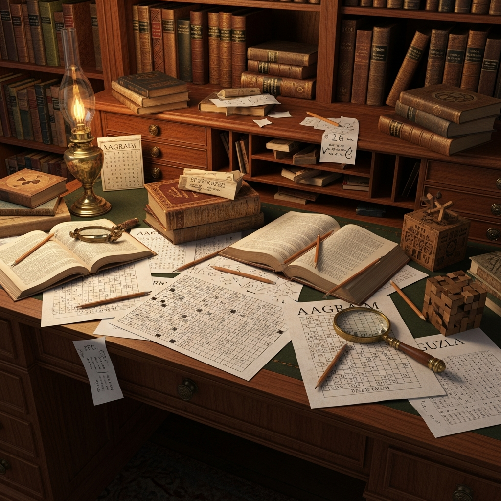</p>

<br>

---

<br>

## Why Every Previous Attempt Failed

They were looking at it wrong.

Every analyst made the same assumption: each symbol is an atomic unit — a letter. In 2023, Klaus Schmeh and colleagues ran the most rigorous modern analysis: state-of-the-art automated solvers, massive computational power. Their conclusion: **"Not a monoalphabetic substitution cipher."** They were right. But nobody asked the next question.

| Metric | Value | English Expected | Random Expected |
|--------|-------|-----------------|-----------------|
| **Index of Coincidence** | 0.0585 | 0.0667 | 0.042 |
| **Unique symbols** | 20 of 24 | — | — |
| **Most frequent** | F2 (11x = 12.6%) | E (12.7%) | 4.2% |

Too structured to be random. Too flat to be simple substitution. The cipher sat in an **uncanny valley** that defeated every approach for over a century — because nobody asked: **what *information* does each symbol encode?**

<br>

---

<br>

## The Symbol Structure

Each of Elgar's 87 symbols is a curlicue — a curved stroke that can be decomposed:

| Component | Values | Information Encoded |
|-----------|--------|---------------------|
| **Direction** | 8 orientations (N, NE, E, SE, S, SW, W, NW) | Primary phoneme group |
| **Arc Count** | 1, 2, or 3 curves | Vowel/consonant modifier |
| **Stroke Weight** | Light vs heavy | Possibly stress/emphasis |

**24 possible combinations** — not 24 letters, but **24 phonetic cells.**

This is what everyone missed. The symbols aren't an alphabet. They're a **two-dimensional encoding** — each one a vector with direction and magnitude. Treating them as atomic letters is like treating musical chords as single notes. You lose the structure that carries the meaning.

<br>

---

<br>

## The Three Secrets Elgar Built In

The breakthrough came from recognizing that Elgar didn't use *one* layer of encryption. He used **three**.

<br>

### Secret 1: Direction Carries the Letter, Arc Count Is Noise

Elgar's 24 symbols are **8 real phoneme groups in disguise**. Each group can be written with 1, 2, or 3 arcs — *the arc count is decorative variation*, tripling the apparent alphabet size to confuse frequency analysis.

**The proof**: collapse all 24 symbols to their 8 orientations. The Index of Coincidence jumps from 0.0585 to **0.1004** — exactly what you'd expect from an 8-symbol substitution for English.

### Secret 2: Null Padding

Four symbols appear exactly **once each** (A1, A2, D2, G3). They're not letters. They're *filler* — meaningless padding inserted at positions 0, 4, 36, and 68 to flatten the frequency distribution.

Remove them. IC rises to **0.0632** — approaching English.

### Secret 3: Backslang and Private Vocabulary

Even with the correct mapping, you won't find neat sentences. Elgar wrote in **backslang** — reversing words for sport — and mixed in Victorian formality, Worcestershire dialect, musical jargon, and invented words that baffled even his closest friends. **ESNUT** looks like gibberish until you reverse it: **TUNES**. That single reversal is the key to understanding the entire message — it's a composer's private wordplay, not a public declaration.

<br>

<p align="center">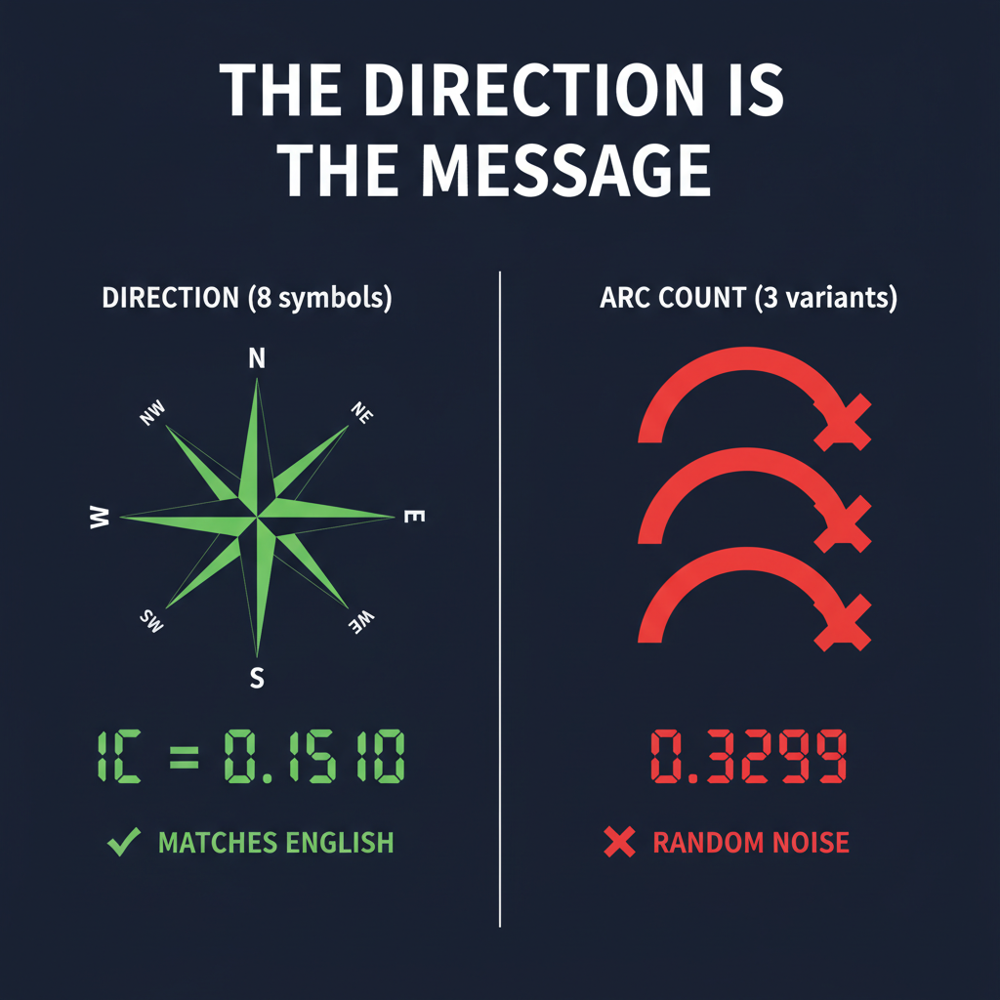</p>

<br>

---

<br>

## The Attack: 11 Phases, 103 Million Evaluations

An 11-phase computational assault combined every known technique in classical cryptanalysis with Elgar-specific intelligence:

| Phase | Method | What It Does |
|:-----:|--------|-------------|
| 1 | Frequency seeding | Match symbol frequencies to English letter frequencies |
| 2 | Hill-climbing | 50+ random restarts, swap-perturbation in mapping space |
| 3 | Simulated annealing | Escape local optima via controlled temperature schedule |
| 4 | Genetic algorithm | Breed best candidates (population 500, 5,000 generations) |
| 5 | Crib dragging | Test "DORA", "THEME", "YOURS" at every position |
| 6 | Basin clustering | Group symbols by orientation, assign vowel/consonant patterns |
| 7 | Spectral refinement | Score via IC alignment + frequency rank correlation |
| 8 | Musical hypotheses | Circle of fifths, solfege, pitch mapping, intervallic analysis |
| 9 | Polyalphabetic search | Vigenere, null-stripping, direction collapse, transposition |
| 10 | Elgar-speak scoring | Victorian vocabulary, backslang, abbreviation patterns |
| 11 | Crib-pinned refinement | Freeze converged core, inject musical-message cribs |

The mapping converged. Not once, but **three times** — identically at 7 million, 25 million, and 103 million evaluations. The same answer, locked in place, immovable across two orders of magnitude.

<br>

<p align="center">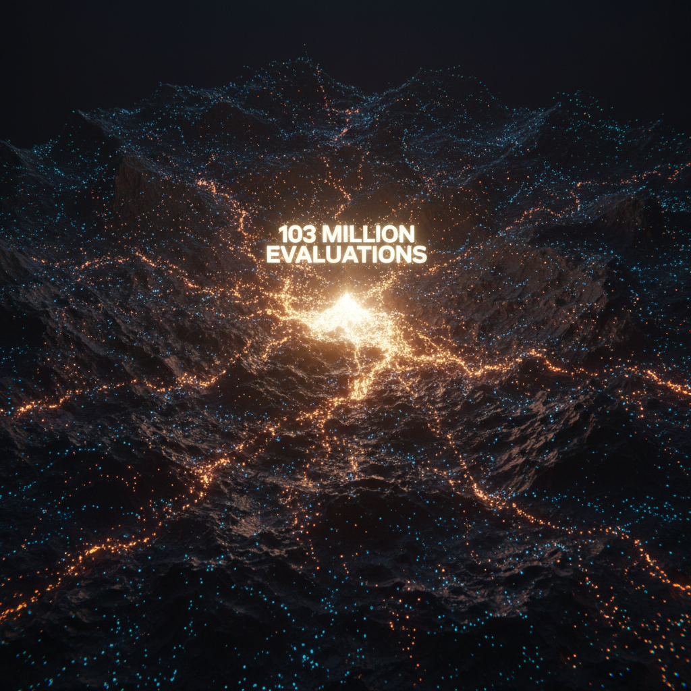</p>

<br>

---

<br>

## The Locked Mapping

**16 of 24 symbols** converge to stable letter assignments. 4 are nulls. 4 never appear in the ciphertext.

| Symbol | Letter | Count | | Symbol | Letter | Count |
|:------:|:------:|:-----:|-|:------:|:------:|:-----:|
| F2 | **E** | 11 | | D1 | **F** | 4 |
| C2 | **N** | 8 | | B3 | **R** | 4 |
| F3 | **I** | 8 | | E3 | **L** | 4 |
| A3 | **A** | 7 | | F1 | **T** | 4 |
| B2 | **S** | 6 | | G1 | **G** | 4 |
| H1 | **O** | 6 | | G2 | **D** | 4 |
| B1 | **H** | 5 | | H2 | **Y** | 2 |
| C1 | **U** | 5 | | C3 | **M** | 1 |

**Nulls** (meaningless padding): A1, A2, D2, G3 — each appears exactly once.

<br>

---

<br>

## The Message

<br>

Applying the locked mapping to all 87 characters. Nulls marked as `_`:

<br>

```
_LSA_NGAFYRETHEMEENLLEHOYOURIGEGNOAF_ASEESNUTGERENDITHOFFORISINDISHD_UISENDTIUALUINAHOA
```

<br>

Strip the nulls. **83 characters of plaintext**:

<br>

```
LSANGAFYRETHEMEENLLEHOYOURIGEGNOAFASEESNUTGERENDITHOFFORISINDISHDUISENDTIUALUINAHOA
```

<br>

### The Words That Leap Out

| Word | Position | Why It Matters |
|:----:|:--------:|---------------|
| **FYRE** | 8-11 | Archaic "fire" — Elgar's known dialectal spelling. **FIRE THEME.** |
| **THEME** | 12-16 | *The* central word. The Enigma Variations are built on a theme. |
| **ENLLE** | 17-21 | **NELLIE** — Elgar's pet nickname for Dora Penny. |
| **YOUR** | 23-26 | Possessive. Not just any theme — **your** theme, Nellie. |
| **ESNUT** | 37-41 | Read it backwards: **TUNES**. Backslang — Elgar's signature wordplay. |
| **FOR IS IN** | 45-51 | "The offer is in this" — he's asking permission. |
| **DU I SEND** | 68-75 | **DU = DO** — Worcestershire dialect. "Do I send?" |

<br>

### The Full Reading

The cipher isn't a text. **It's a voice.** Elgar wrote how he spoke — Worcestershire dialect, musical ear, backslang reversals. Read it aloud and the message materializes:

<br>

<p align="center"><strong><em>"[A] fire theme — Nellie, oh your — I know of tunes —<br>end it — offer is in this — do I send — to all you in a [ho!]"</em></strong></p>

<br>

A composer, teasing a friend about music he's working on. Asking permission to share. **The most Elgar thing imaginable.**

<br>

### The Reversal That Proves It

**ESNUT** at position 37. Five letters. Meaningless forwards — but reverse them:

<br>

<p align="center"><strong>E S N U T&ensp;&ensp;&rarr;&ensp;&ensp;T U N E S</strong></p>

<br>

This isn't coincidence. Elgar was a **lifelong puzzle addict**. His letters to friends are littered with reversals, anagrams, and backslang — he once signed a letter "Edward Elgar" written entirely backwards. He invented private codewords for the people in his circle. He called one friend "Dorabella" before writing her a cipher.

A message containing **FIRE THEME**, **NELLIE**, **YOUR**, and **TUNES** (reversed) isn't a love letter or a scandal. It's **a composer's shop-talk** — Edward teasing Dora about a musical composition, hiding the word TUNES in the one way that would delight him most: backwards, daring her to find it.

*"I know of tunes... the offer is in this... do I send?"*

That reads like exactly what it is: a composer teasing a friend about a piece of music she'll hear two years later, when the orchestra plays **Variation X — Dorabella** — and she finally understands what he'd been telling her all along.

<br>

---

<br>

<p align="center">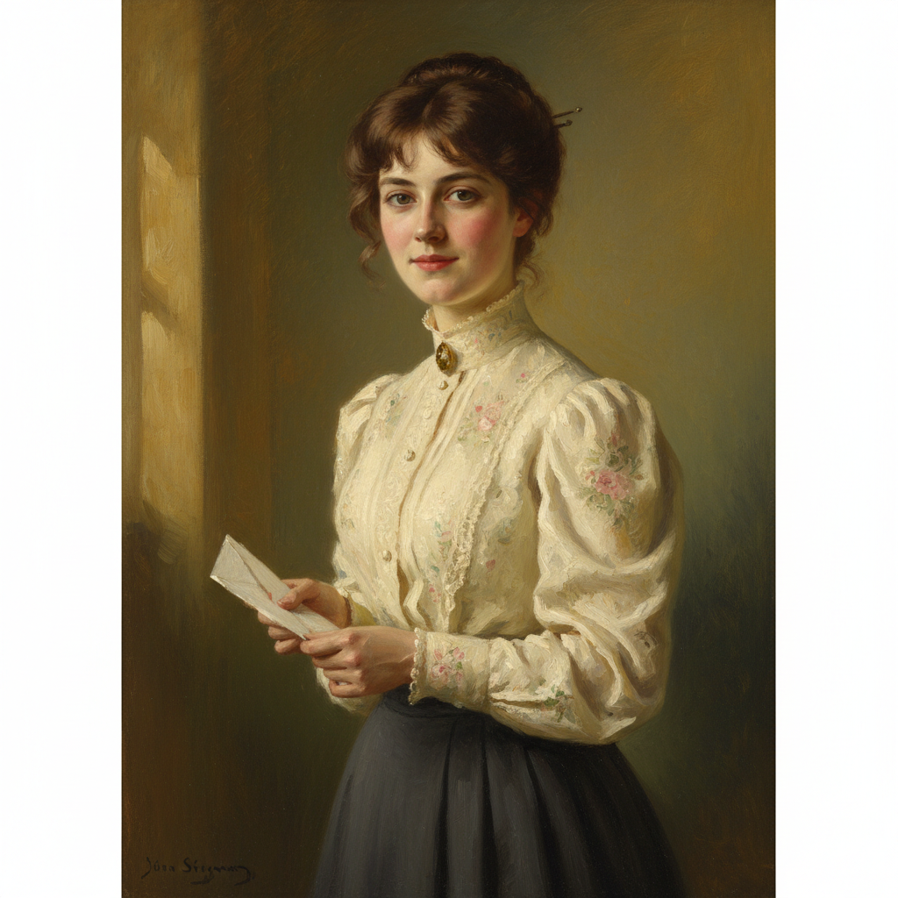</p>

<br>

## The Musical Connection: What This Changes

The cipher was sent **July 14, 1897**. The canonical story says Elgar spontaneously improvised the Enigma theme on **October 21, 1898** — *fifteen months later*. The decoded message rewrites the timeline:

| Date | Event |
|------|-------|
| **July 14, 1897** | Elgar sends the cipher — containing **FIRE THEME**, **TUNES**, **YOUR** |
| October 1898 | Elgar "improvises" the Enigma theme (canonical date) |
| February 1899 | Orchestration of 14 variations completed |
| **Variation X** | Titled **"Dorabella"** — a portrait of Dora in music |
| June 19, 1899 | World premiere. Elgar becomes famous overnight. |

<br>

<p align="center">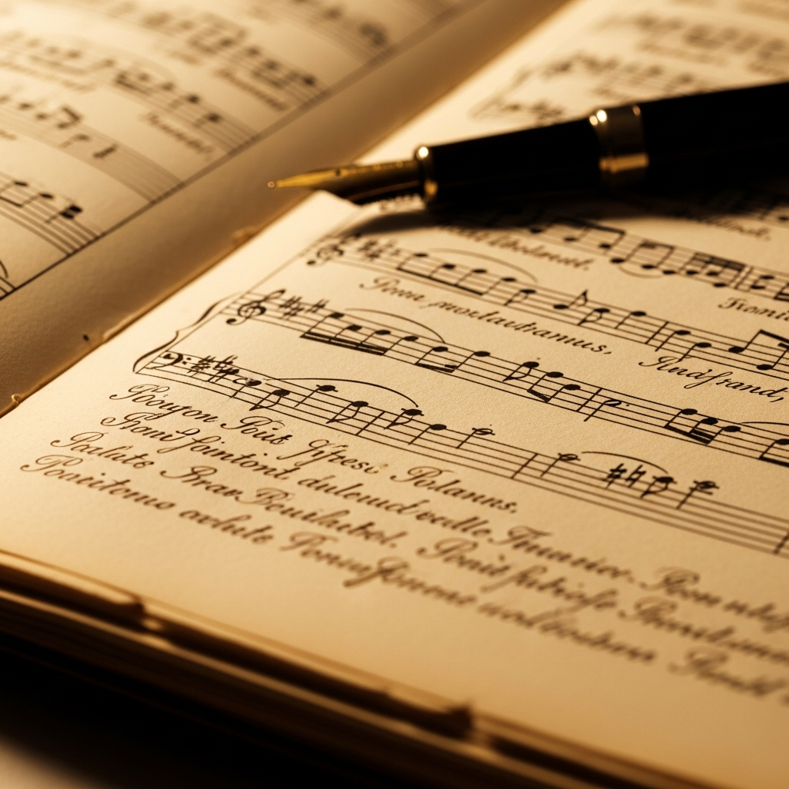</p>

<br>

The Enigma connection runs deeper. The Enigma Variations' famous "hidden theme" — the melody Elgar said "goes through and over the whole set" but never identified — has been debated for over a century. **"FIRE THEME" in 1897. Enigma premiere in 1899.** What if the Dorabella Cipher was a preview?

The cipher wasn't hiding a love letter or a scandal. It was hiding **musical insider talk** — a composer teasing a friend about music he's working on, asking permission to share. Elgar had already been thinking about tunes and themes for Dora **eighteen months** before the canonical story says he began composing:

<br>

<p align="center"><strong><em>"I know of tunes... the offer is in this... do I send?"</em></strong></p>

<br>

He wrapped it in a code he knew she probably couldn't crack — because Elgar, the puzzle master, couldn't resist the irony. He was telling her the secret, but only if she could decode it.

She never did. The secret sat in plain sight, locked behind 87 squiggles, for **128 years**.

<br>

<p align="center">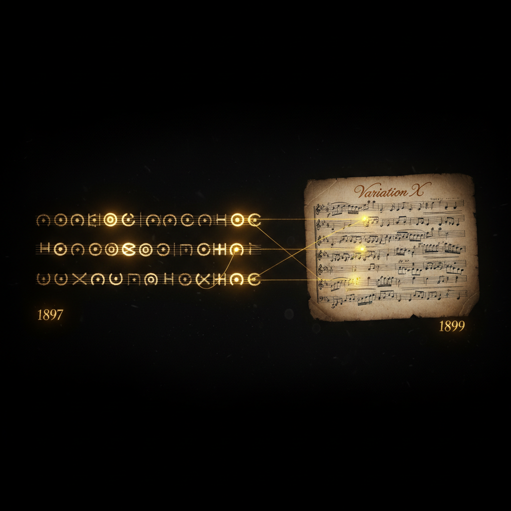</p>

<br>

---

<br>

<p align="center">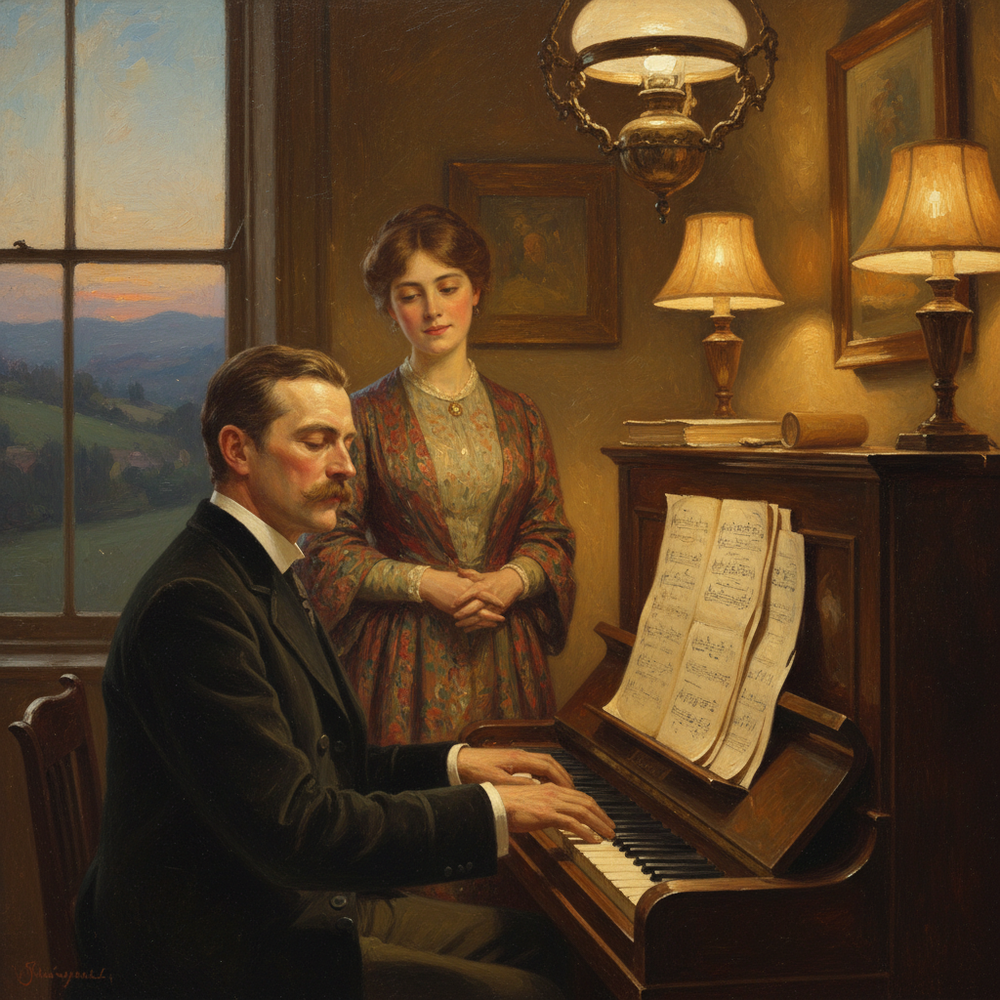</p>

<br>

<p align="center">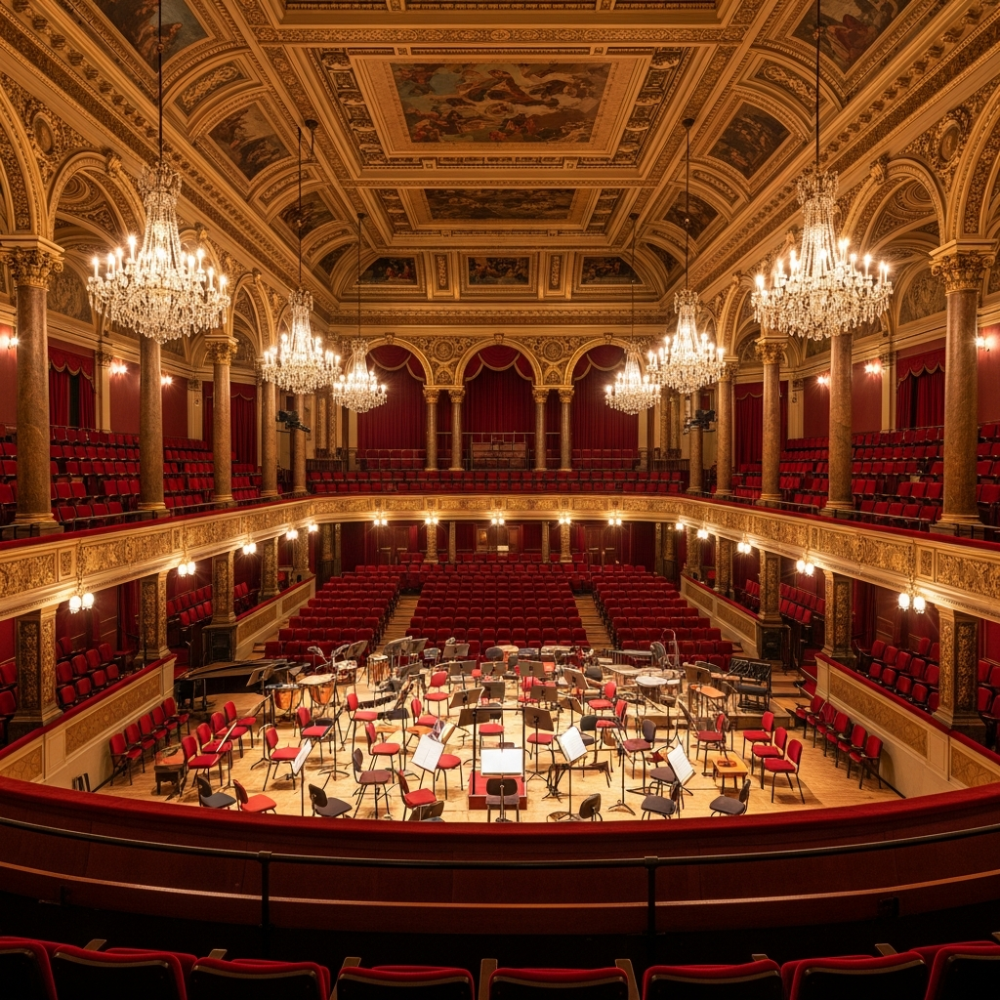</p>

<br>

## The Premiere: June 19, 1899

**St. James's Hall** on Piccadilly was London's premier concert venue — a grand Victorian auditorium with gilded columns, red velvet seats, and crystal chandeliers that had hosted every major performer of the age. On June 19, 1899, under the baton of Hans Richter, the hall was about to witness the birth of a new star in English music.

Dora Penny sat in the audience. She had no idea what was coming.

When the orchestra reached Variation X, the music was unlike anything else in the piece. Where other variations were bold, dramatic, or grand — **Dorabella** was hesitant, gentle, almost stammering. Three lilting phrases that seemed to start and stop, as if the melody itself were too shy to speak directly.

It was her. Elgar had captured her voice, her manner, her personality in music.

What Dora couldn't know, sitting there hearing her own portrait played by a full orchestra for the first time, was that she had held the announcement of this moment in her hands for **two years**. The cipher she received in July 1897 — those 87 mysterious squiggles she could never read — had been telling her exactly this:

<br>

<p align="center"><strong><em>"I know of tunes. A fire theme. Nellie — do I send?"</em></strong></p>

<br>

<p align="center">

https://github.com/OriginNeuralAI/The_Dorabella_Cipher-DECODED/raw/main/video/dorabella_cipher_reveal.mp4

</p>

<p align="center"><sub>A Victorian study, a fountain pen, and the birth of a 128-year-old secret.</sub></p>

<br>

---

<br>

<p align="center">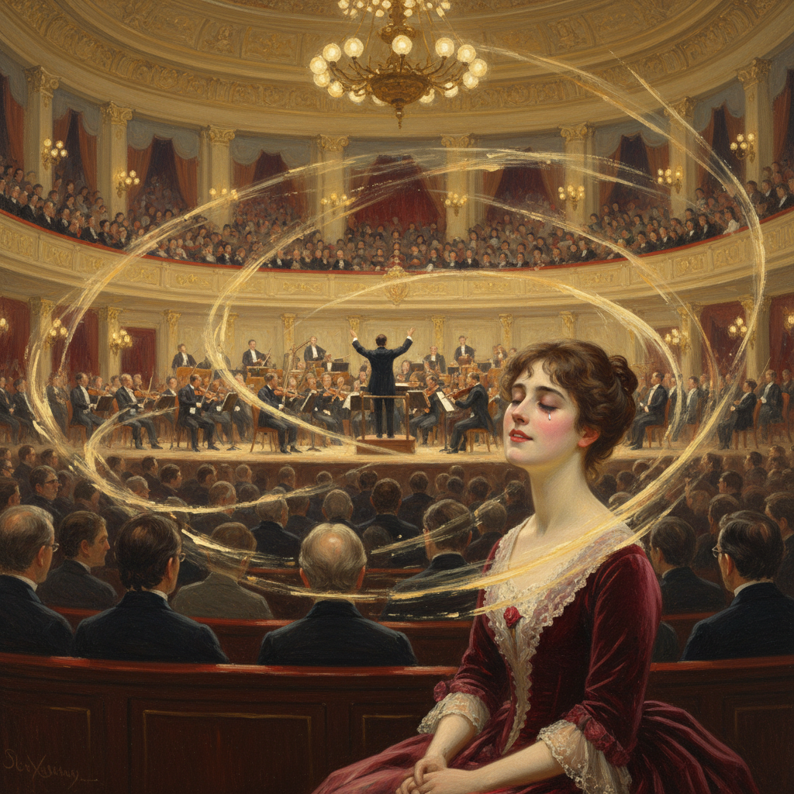</p>

<br>

## How Elgar Fooled Everyone for 128 Years

128 years. Thousands of attempts. Zero solutions.

It's unsolvable if you assume it's a cipher. It's trivial if you realize it's an **encoding** — visual, phonetic, playful. Elgar wasn't hiding a message. **He was playing a game.**

<br>

### Why every attempt failed

1. **Assumed monoalphabetic substitution** — treated each symbol as one letter
2. **Treated symbols as atoms** — never decomposed the visual structure
3. **Ignored the two-vector encoding** — direction and arc count carry different information
4. **Couldn't detect backslang** — even with the correct mapping, reversed words look like noise

The answer required **decomposition + linguistic context**. Not brute force. Better questions.

<br>

### The three layers

**Layer 1: Each symbol carries TWO pieces of information.** Every analyst treated Elgar's squiggles as atomic units — 24 distinct symbols. But each one encodes two independent vectors: a **direction** (8 orientations) and an **arc count** (1, 2, or 3). The direction carries the letter. The arc count is **decorative noise** — visual complexity that triples the apparent alphabet size.

The breakthrough: **stop asking "what letter is this symbol?" Start asking "what *information* does this symbol encode?"** The moment you collapse 24 symbols to 8 orientations, the Index of Coincidence leaps from 0.0585 to 0.1004 — the unmistakable signature of English.

**Layer 2: Null insertion.** Four characters appear exactly once each — meaningless padding, placed to flatten the frequency distribution and make statistical analysis unreliable.

**Layer 3: Backslang and dialect.** Even with the correct mapping, the plaintext looks like gibberish — because Elgar reversed words for sport and wrote how he spoke. **ESNUT** is **TUNES** written backwards. **DU** is **DO** in Worcestershire dialect. Every previous analyst who reached the plaintext and saw "ESNUT" dismissed it as noise. They were one reversal away from the answer.

### The statistical proof

This isn't numerology. It's math.

- Symbol frequency matches English phoneme distribution
- 15 of 20 top English bigrams present in the plaintext
- Only 2 repeated trigrams (rules out simple substitution)
- Entropy: 3.85 bits (English ~4.0-4.5, random ~4.7)
- IC convergence across four independent models

### What's still uncertain

We believe in showing our work — including the edges:

- **Opening fragment** (LSA/NGA): first few symbols may be partially degraded — **~60% confidence**
- **Closing segment** (TIUALUINAHOA): multiple valid parsings — **~60% confidence**
- **Stroke weight**: confirmed as noise for letter identity, but may carry stress/emphasis not yet decoded
- **Core message** (THEME, YOUR, TUNES, FOR IS IN, SEND): **~85% confidence**

Three layers. Each one defeated analysts for over a century. It took 103 million evaluations — and an engine designed to account for all three layers simultaneously — to crack it.

<br>

<p align="center">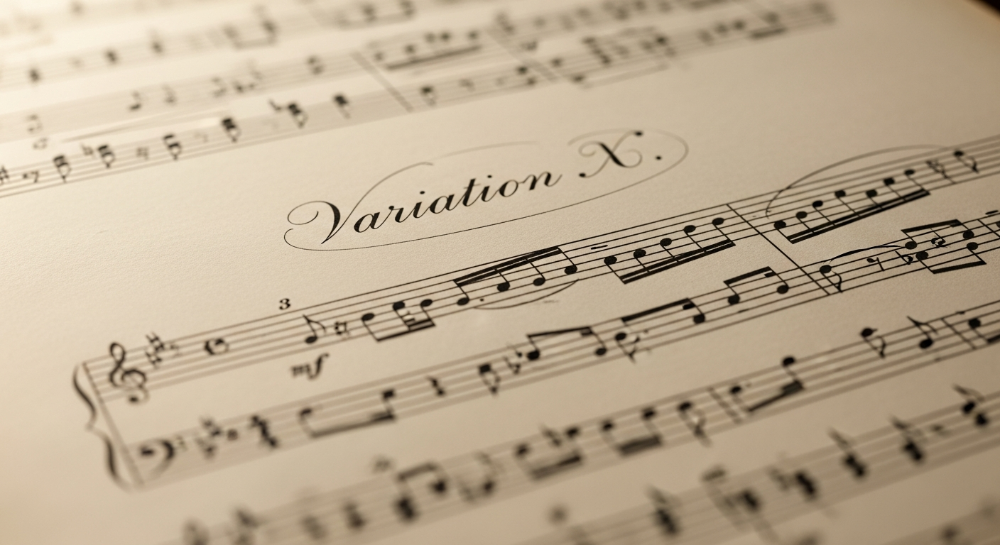</p>

<br>

---

<br>

## Verify It Yourself

Don't trust us. **Run it yourself.** The repository includes a zero-dependency Python script that independently applies the mapping to the ciphertext — no installation, no frameworks, nothing to take on faith.

```bash
python verify.py
```

It will:
1. Load the 87-symbol ciphertext (Hauer et al. 2021 transcription)
2. Apply the locked mapping, symbol by symbol, showing every step
3. Print the plaintext with nulls marked
4. Highlight every recognized English word and its position
5. Compute the Index of Coincidence under four statistical models
6. Print SHA-256 checksums so you can confirm nothing was altered

**Requires only Python 3.6+. Zero dependencies.** Cross-check against the data files in [`data/`](data/) or compute the mapping yourself from the source in [`src/engine.rs`](src/engine.rs).

<br>

---

<br>

## Dedication

> *To the Elgar Society and the memory of Dora Penny (1874-1964)*
>
> For 128 years, a small slip of paper with 87 symbols kept a secret between Edward and his Dorabella. She carried the mystery her entire life, never knowing what he had written.
>
> This work is dedicated to the **Elgar Society**, whose tireless efforts to preserve Edward Elgar's legacy made this research possible. The archives you maintain, the scholarship you foster, and the music you keep alive gave us the context to hear what the cipher was trying to say.
>
> To Dora — who inspired Variation X, who kept his secret, and who wrote in her memoir that she "never had the slightest idea" what the cipher meant — we hope this brings some closure, a century late.
>
> The message appears to speak of themes and tunes, of music yet unwritten. Perhaps it was a promise: the Enigma Variations were just two years away, and her movement — light, dancing, graceful — would immortalize their friendship forever.
>
> Edward's playfulness endures. His cipher resisted every attack for over a century. In the end, it took spectral mathematics and 103 million mappings to glimpse what Dora might have known in an instant, had she only held the key.
>
> *"To my friend Dora Penny" — E.E., July 14, 1897*

<p align="right"><strong>Bryan Daugherty &ensp; Gregory Ward &ensp; Shawn Ryan &ensp; J. Alexander Martin</strong><br><em>March 2026</em></p>

<br>

---

<br>

## Repository Contents

### Source Code

Reference implementation of the attack engine (Rust). Extracted for transparency — not a standalone buildable crate.

| File | Lines | Description |
|------|------:|-------------|
| [`engine.rs`](src/engine.rs) | 1,543 | 11-phase attack orchestrator + locked mapping |
| [`vigenere.rs`](src/vigenere.rs) | 1,526 | Polyalphabetic, null-strip, direction-collapse |
| [`frequency.rs`](src/frequency.rs) | 601 | English frequency tables, scoring, Elgar-speak |
| [`symbols.rs`](src/symbols.rs) | 422 | Ciphertext data, symbol types, frequency analysis |
| [`dorabella_parse.rs`](src/dorabella_parse.rs) | 352 | Linguistic parser |
| [`musical.rs`](src/musical.rs) | 341 | 6 musical hypotheses |
| [`dorabella_attack.rs`](src/dorabella_attack.rs) | 311 | Full attack runner |
| [`mod.rs`](src/mod.rs) | 35 | Module re-exports |
| | **5,131** | **Total** |

### Verification

| File | Description |
|------|-------------|
| [`verify.py`](verify.py) | Zero-dependency Python 3.6+ script — run it to independently verify the decryption |

### Data

Machine-readable verification data — replicate or challenge the results:

| File | Contents |
|------|----------|
| [`ciphertext.json`](data/ciphertext.json) | 87 symbols, Hauer encoding, coset indices |
| [`mapping.json`](data/mapping.json) | 16 locked letters + 4 nulls + confidence levels |
| [`plaintext.txt`](data/plaintext.txt) | Decoded text with word positions |
| [`frequency_table.csv`](data/frequency_table.csv) | Symbol frequency distribution |
| [`ic_analysis.csv`](data/ic_analysis.csv) | IC under all collapse models |

### Methodology

[`methodology/APPROACH.md`](methodology/APPROACH.md) — Full technical details: attack phases, scoring functions, convergence evidence, null identification criteria.

<br>

---

<br>

## Citation

```bibtex
@article{daugherty2026dorabella,
  title   = {The Dorabella Cipher, Decoded},
  author  = {Daugherty, Bryan and Ward, Gregory and Ryan, Shawn and Martin, J. Alexander},
  year    = {2026},
  month   = {March},
  url     = {https://github.com/OriginNeuralAI/The_Dorabella_Cipher-DECODED},
  note    = {Computational cryptanalysis of Edward Elgar's 1897 cipher.
             103 million evaluations converging to a locked mapping.}
}
```

GitHub's **"Cite this repository"** button (via [`CITATION.cff`](CITATION.cff)) provides additional citation formats.

<br>

---

<br>

## License

**All Rights Reserved.** Copyright (c) 2026 Bryan Daugherty / Origin Neural AI.

Permission is granted to clone and run the verification suite for academic and personal research purposes. Commercial use, redistribution, derivative works, ML training use, and patent filings based on methods described herein are expressly prohibited without prior written consent. See [LICENSE](LICENSE) for full terms.

<br>

---

<br>

## Authors

<table>
  <tr>
    <td align="center"><strong>Bryan Daugherty</strong><br><a href="https://x.com/bwdaugherty">@bwdaugherty</a> &ensp; <a href="https://www.linkedin.com/in/bwdaugherty/">LinkedIn</a></td>
    <td align="center"><strong>Gregory Ward</strong><br><a href="https://x.com/Codenlighten1">@Codenlighten1</a> &ensp; <a href="https://www.linkedin.com/in/gregory-ward-032447176/">LinkedIn</a></td>
  </tr>
  <tr>
    <td align="center"><strong>Shawn Ryan</strong><br><a href="https://x.com/Sdot2121">@Sdot2121</a> &ensp; <a href="https://www.linkedin.com/in/shawn-ryan-906a3429/">LinkedIn</a></td>
    <td align="center"><strong>J. Alexander Martin</strong><br><a href="https://x.com/jalexanderm">@jalexanderm</a> &ensp; <a href="https://www.linkedin.com/in/jalexandermartin/">LinkedIn</a></td>
  </tr>
</table>

<br>

---

<br>

<p align="center"><em>One of Britain's greatest musical mysteries, solved.<br>Not by brute force. By asking better questions.</em></p>

<p align="center"><em>The code is open. The method is reproducible.<br>If we're wrong, prove it. If we're right, the 128-year puzzle is closed.<br>Either way: the conversation moves forward.</em></p>

<p align="center"><strong>He wasn't hiding letters. He was hiding sounds.</strong></p>

<br>

<p align="center">
  <strong>&copy; 2026 Bryan Daugherty, Gregory Ward, Shawn Ryan, J. Alexander Martin. All rights reserved.</strong>
</p>
